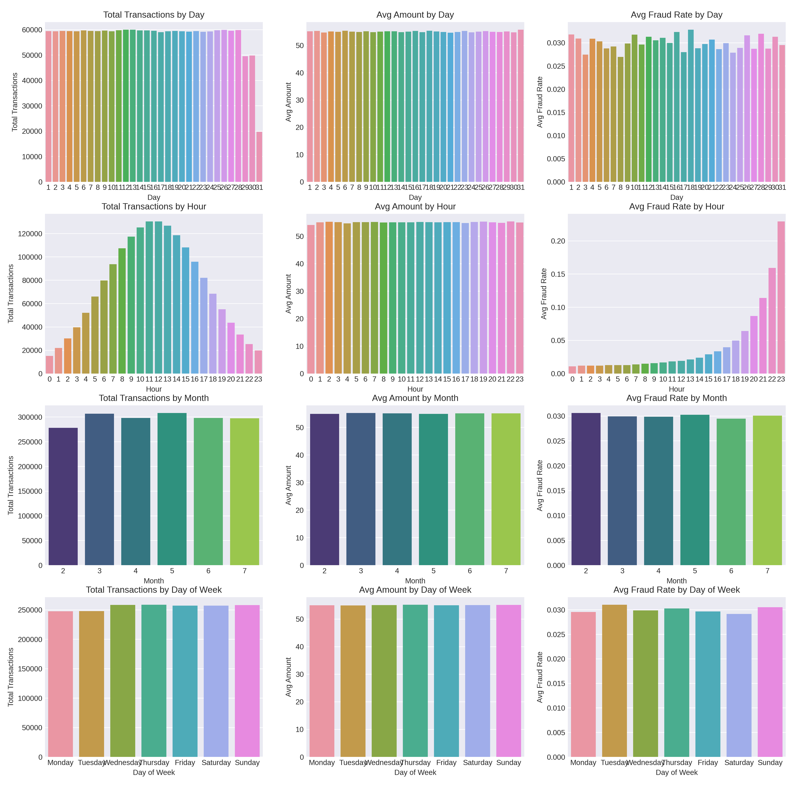

# Credit Card Transaction Analysis 

# Goal 

This project uses advanced SQL to perform an in-depth exploratory data analysis of a financial transaction dataset. The primary goal is to identify and analyze key indicators, patterns, and anomalies associated with fraudulent activity, providing data-driven insights to inform a robust fraud detection and prevention system.

# Background

Financial fraud poses a major challenge in today's digital economy, leading to significant financial losses for businesses and a loss of trust for customers. This project focuses on analyzing a synthetic financial transaction dataset, which includes detailed information on individual transactions, customer behaviors, and terminal usage patterns.

The primary purpose is to leverage SQL for in-depth data analysis. By exploring this rich dataset, the project aims to identify and understand key patterns, anomalies, and risk factors associated with fraudulent transactions. The insights gained from this analysis provide a crucial foundation for building more intelligent and proactive fraud detection and prevention systems.

# Insights Summary

## 1. Transaction Value and Velocity

- Fraudulent transactions are higher in value, with an average transaction amount of $79.57 compared to $54.27 for non-fraudulent ones. This suggests fraudsters target higher-value transactions.
- The time between fraudulent transactions is significantly shorter (approximately 0.22 days) compared to non-fraudulent transactions (0.50 days). This rapid succession of transactions is a strong indicator of automated, high-speed fraud.

## 2. High-Risk Indicators & "Hotspots"

- Fraudulent activity is not concentrated in specific entry modes like 'Contactless' or 'Chip'—it is distributed relatively evenly across all three major types.
- Late-night hours (19:00 - 23:00) show a significantly higher frequency of fraudulent transactions. This temporal pattern could be used to implement more aggressive fraud checks during these high-risk periods.

## 3. Behavioral & Locational Anomalies

- High-risk customers often exhibit unusual terminal usage behavior. Specifically, a segment of customers with high transaction volume but low terminal usage coverage (<20%) correlates with a higher number of fraudulent transactions. This suggests they are using a small subset of their available terminals, potentially for illicit activity.
- There is a clear pre/post-fraud behavioral shift. For customers who have committed fraud, the average transaction amount for transactions immediately following their first fraudulent transaction is substantially higher than the amount for their previous transactions.
- While some customers have a higher number of available terminals and also commit fraud, the data does not show a strong correlation between the distance from a customer's home to a terminal and fraudulent activity. This finding is useful for dispelling common assumptions and focusing analysis on other, more relevant metrics.

# Recommendations

Based on the analysis of transactional data, the following recommendations are proposed to enhance fraud detection and prevention systems:

## 1. Implement a Risk-Scoring Model

Develop a machine learning model that calculates a real-time risk score for each transaction. The model should prioritize the following features identified in this analysis:

- Transaction Value: Flag transactions that are significantly higher than a customer’s average.
- Transaction Velocity: Monitor for transactions that occur in rapid succession, especially at unusually high speeds.
- Temporal Patterns: Assign a higher risk score to transactions that occur during identified high-risk periods (e.g., between 7:00 PM and 11:00 PM).

## 2. Enhance Terminal and Customer Monitoring

- Implement a targeted monitoring program for high-risk entities:
- Terminals: Proactively monitor and, if necessary, temporarily suspend or investigate terminals that show a disproportionately high fraud percentage or a high absolute number of fraudulent transactions.
- Customers: Flag customers who exhibit anomalous behavior, such as a low terminal usage coverage combined with a high transaction volume. These customers may warrant additional security checks.

## 3. Focus on Behavioral Analytics

- Move beyond static rules to incorporate dynamic behavioral analysis:
- Pre/Post-Fraud Behavior: Create a system to detect a significant shift in a customer’s average transaction amount after an initial fraudulent event. This serves as a strong signal for a potential account takeover or compromised card.
- Geographic Analysis: While the initial analysis did not show a strong correlation between fraud and distance from a customer’s home, it is still recommended to integrate a customer’s home location and terminal location data for more sophisticated geospatial analysis in future models. This could uncover more nuanced location-based patterns.

# Visualisation

The visualizations by day of the month, hour of the day, month, and day of the week reveal key behavioral patterns. For example, the Avg Fraud Rate by Hour plot clearly shows an increase in fraud during evening hours, while the Total Transactions by Month plot illustrates general transaction trends over theses months. These time-based insights are crucial for building a more effective fraud detection system.

# Challenges Faced and Solutions

## 1. Data Compatibility and Schema Design

- Challenge: The raw data, particularly the customer_terminal_map, was provided in a format that did not align with a standard relational database schema. Using it as-is would have led to redundant data and inefficient querying.

- Solution: I addressed this by normalizing the data. I first designed a relational schema and then split the raw data into separate tables (customer_profiles, terminal_profiles, etc.) to eliminate redundancy and establish clear relationships. This foundational work was crucial for building all subsequent advanced queries.

## 2. Timestamp Formatting and Manipulation

- Challenge: The timestamp data (post_ts) was not in a format that was immediately compatible with SQL's built-in date and time functions. This prevented accurate time-based calculations, such as identifying the ±14 day window around fraudulent events.

- Solution: I explicitly converted the string timestamps into a recognized TIMESTAMP data type. This ensured that all time-based operations, including date arithmetic and ordering, were performed correctly, allowing for precise event-driven analysis.

## 3. Complexity of Advanced SQL

- Challenge: Some of the required analyses, such as the pre/post behavior shift and terminal usage coverage, demanded the use of complex SQL techniques like Common Table Expressions (CTEs), window functions, and geospatial calculations. Implementing these correctly from scratch was a significant learning curve.
- Solution: I systematically broke down complex problems into smaller, more manageable steps, often using CTEs to stage intermediate results. To overcome the technical challenges of new syntax, I relied on online resources, including official documentation, W3Schools for syntax references, LinkedIn Learning online courses, and YouTube tutorials for conceptual understanding. This approach not only solved the immediate problems but also strengthened my overall SQL knowledge.

# Data Structure 

The dataset contained four tables, including information about customer_profiles, transactions, terminal_profiles, and customer_terminal_map.

# Presentation Sample

Presentation slides are in the process of making, and will soon be publised when completed.

# Technologies Used

- Programming Language: Python
- Data Manipulation & Analysis: Pandas, NumPy, psycopg2
- Data Visualisation: Matplotlib, Seaborn
- Database and Query: PostgreSQL, SQL
- Jupyter / Kaggle Notebook

# Author

Mr. Pakkapol Satthapiti | MSC of Data Science and AI | The University of Liverpool | Feel free to connect!